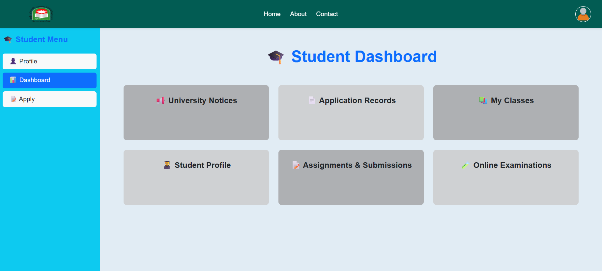

# 🌟 UniTranscript – University Transcript Management System

📌 **Project Overview**

UniTranscript is a full-stack web application designed for managing university transcript requests and student assessments for ** ([JKKNIU](https://www.jkkniu.edu.bd/))**.🎯.  
Students can apply for transcripts, view assignments, attend online exams, and check the notice board. Admins and department staff manage student data, payments, applications, and exam permissions.

---

## 🚀 Core Features

### 👤 Student Features

- 📝 Apply for transcript requests
- 📂 View assignments and grades
- 🖥 Attend online exams
- 📌 Access notice board updates

### 🧑‍💼 Admin Features

- 👥 Manage students, registrations, and departments
- 💰 Approve payments and transcript applications

### 🧑‍💻 Registration Admin Features

- ✅ Verify student validity
- 💵 Accept payments
- 🏛 Handle department admin assignments

### 🏫 Department Admin Features

- 📂 Manage department students
- 📌 Add notices to notice board
- 🖥 Allow students to attend exams

---

## 🛠 Technology Stack

### 🎨 Frontend

- React.js
- Bootstrap
- React Hook Form
- React Toastify
- React Icons
- SweetAlert2

### ⚙ Backend

- Raw PHP

### 🗄 Database

- MySQL (via XAMPP)

---

## 🧭 Pages & Routing

### 🌐 Public Pages

- `/` – Home
- `/login` – Login
- `/student` – Student Dashboard
- `/admin` – Admin Dashboard
- `/registradmin` – Registration Admin Dashboard
- `/departmentadmin` – Department Admin Dashboard

---

## 📚 Important NPM Packages

`react, react-dom, react-hook-form, react-toastify, react-icons, sweetalert2`

---

## 🌟 Key Highlights

- 🔑 Role-based dashboards (Student, Admin, Registration Admin, Department Admin)
- 🔐 Secure PHP backend with MySQL database
- 💵 Payment handling for transcript approval
- 📝 Online exam access and management
- 📌 Dynamic notice board for announcements
- 🎨 Responsive UI using React and Bootstrap

---

## 🖼 Project Screenshots

  

---

## 🔐 Admin Panel & Demo Login Accounts

### 👤 Students

- **Email:** mgrahul639@gmail.com  
  **Password:** Mg@12345

- **Email:** test@gmail.com  
  **Password:** Mg123456$

- **Incomplete Registration:**  
  **Email:** saad@gmail.com  
  **Password:** Mg@12346

### 🧑‍💼 Admin

- **CSE Department Admin:**  
  **Email:** cse@example.com  
  **Password:** admin12345

### 🧑‍💻 Registration Admin

- **Email:** register@example.com  
  **Password:** admin12345

# 👨‍💻 Author

MD. Raful Mia
University Project
**JKKNIU ([Jatiya Kabi Kazi Nazrul Islam University](https://www.jkkniu.edu.bd/))**

---
